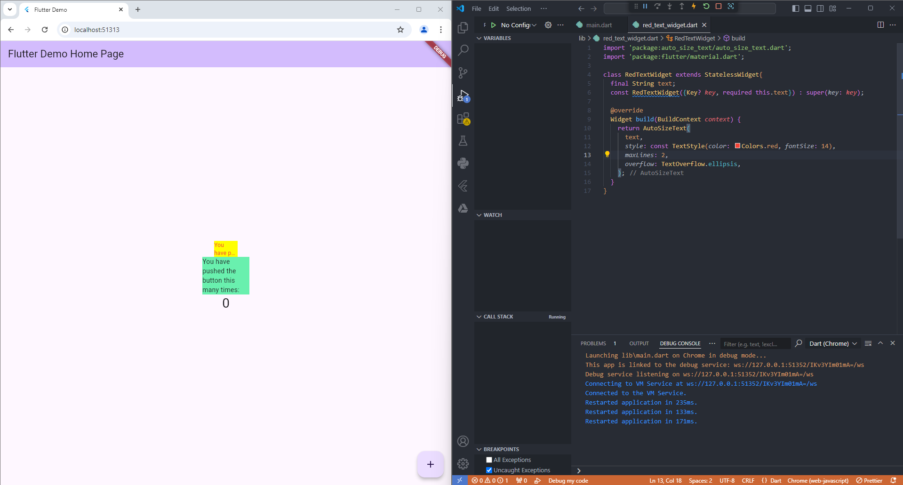

# flutter_plugin_pubdev

**NIM**: 2241720136  
**Nama**: Ahmad Mumtaz Haris 

#### Langkah 2
Perintah flutter pub add auto_size_text digunakan untuk menambahkan package atau pustaka bernama auto_size_text ke dalam proyek Flutter. Package ini memungkinkan untuk membuat teks yang secara otomatis menyesuaikan ukuran agar pas dalam sebuah ruang tertentu

#### Langkah 5
deklarasi final String text; dan konstruktor const RedTextWidget({Key? key, required this.text}) : super(key: key); digunakan untuk menerima teks yang akan ditampilkan oleh widget RedTextWidget. Final menunjukkan bahwa variabel text hanya dapat diinisialisasi sekali dan tidak dapat diubah. required this.text menunjukkan bahwa parameter text wajib diisi ketika membuat objek RedTextWidget.

#### Langkah 6
Perbedaan widget RedTextWidget dan Text adalah RedTextWidget menggunakan widget AutoSizeText dari paket auto_size_text, yang secara otomatis mengatur ukuran teks agar sesuai dengan batas ruang yang tersedia di dalam widget. Sedangkan Text tidak secara otomatis menyesuaikan ukuran teks. Jika teksnya terlalu panjang untuk ruang yang tersedia, itu akan terpotong atau menyebabkan overflow.

#### Parameter plugin auto_size_text
    -text: Teks yang ditampilkan.
    -style: Gaya teks sepertri warna, ukuran font, ketebalan, dll.
    -minFontSize: Ukuran font minimum yang akan digunakan jika teks terlalu besar untuk ruang yang tersedia.
    -maxFontSize: Ukuran font maksimun yang akan digunakan. Defaultnya adalah ukuran font dari TextStyle.
    -stepGranularity: Interval penyesuaian ukuran font ketika mengecilkan teks. Misalnya, jika stepGranularity diatur ke 2, maka ukuran font akan turun dua unit setiap kali mengecilkan teks.
    -maxLines: Jumlah baris maksimum yang diizinkan untuk teks. Jika teks melebihi jumnlah baris ini, maka teks akan dipotong atau dikurangi sesuai dengan kebijakan overflow.
    -overflowReplacement: Widget pengganti tika teks melampaui batas yang ditentukan dan tidak bisa ditampilkan secara keseluruhan.
    -presentFontSizes: Daftar ukuran font yang telah diatur sebelumnya untuk dipilih secara otomatis. AutoSizeText akan mencoba setiap ukuran dalam daftar ini untuk menemukan yang sesuai.
    -overflow: Mengontrol bagaimana teks yang melebihi batas ruang akan ditampilkan (misalnya, TextOverflow.ellipsis untuk menampilkan tanda titik-titik (...)).
    -textAlign: Mengatur perataan teks secara horizontal (misalnya, TextAlign.left, TextAlign.center, atau TextAlign.right).
    -textDirection: Mengatur arah teks (kiri ke kanan atau kanan ke kiri).
    -wrapWords: Jika false, teks hanya akan mengecilkan ukuran font dan tidak akan memisah kata. Defaultnya adalah true.
    -key: Kunci unik untuk widget ini, seperti widget lai pada umumnya.
    -strutStyle: Mengontrol gaya baris dari teks, seperti tinggi baris dan jarak antar karakter.
    -textScaleFactor: Skala faktor yang diterapkan pada ukuran font untuk menyesuaikan dengan preferensi ukuran teks sistem pengguna.
    -softWrap: Menentukan apakah teks akan dibungkus secara otomatis ke baris berikutnya jika melebihi lebar container.